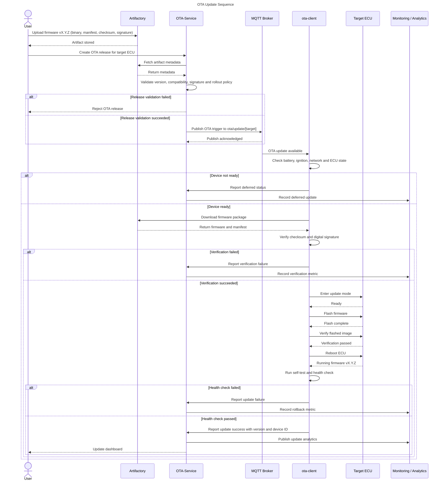

```mermaid
sequenceDiagram
    title OTA Update Sequence

    actor User
    participant Artifactory
    participant OTA as OTA-Service
    participant MQTT as MQTT Broker
    participant Client as ota-client
    participant ECU as Target ECU
    participant Mon as Monitoring / Analytics

    User->>Artifactory: Upload firmware vX.Y.Z (binary, manifest, checksum, signature)
    Artifactory-->>User: Artifact stored

    User->>OTA: Create OTA release for target ECU
    OTA->>Artifactory: Fetch artifact metadata
    Artifactory-->>OTA: Return metadata

    OTA->>OTA: Validate version, compatibility, signature and rollout policy

    alt Release validation failed
        OTA-->>User: Reject OTA release
    else Release validation succeeded
        OTA->>MQTT: Publish OTA trigger to ota/update/[target]
        MQTT-->>OTA: Publish acknowledged
    end

    MQTT->>Client: OTA update available

    Client->>Client: Check battery, ignition, network and ECU state

    alt Device not ready
        Client->>OTA: Report deferred status
        OTA->>Mon: Record deferred update
    else Device ready

        Client->>Artifactory: Download firmware package
        Artifactory-->>Client: Return firmware and manifest

        Client->>Client: Verify checksum and digital signature

        alt Verification failed
            Client->>OTA: Report verification failure
            OTA->>Mon: Record verification metric

        else Verification succeeded

            Client->>ECU: Enter update mode
            ECU-->>Client: Ready

            Client->>ECU: Flash firmware
            ECU-->>Client: Flash complete

            Client->>ECU: Verify flashed image
            ECU-->>Client: Verification passed

            Client->>ECU: Reboot ECU
            ECU-->>Client: Running firmware vX.Y.Z

            Client->>Client: Run self-test and health check

            alt Health check failed
                Client->>OTA: Report update failure
                OTA->>Mon: Record rollback metric

            else Health check passed
                Client->>OTA: Report update success with version and device ID
                OTA->>Mon: Publish update analytics
                OTA-->>User: Update dashboard
            end

        end
    end
```
