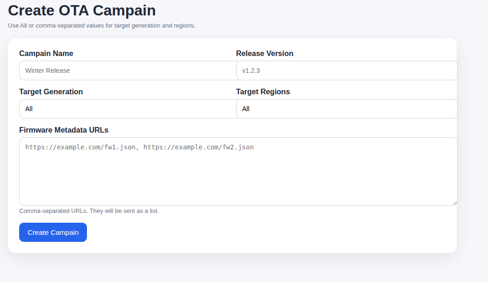

# OTA Campain Service

A small Flask + MQTT backend for creating OTA campains, publishing update commands to vehicles, and tracking vehicle status updates.

## What it does

- `POST /api/campain/new`
  - creates a new campain id
  - filters vehicles from `vehicle-data.json`
  - publishes `/vehicles/<vehicleId>/commands/ota-update`
  - writes `campain-status.json`

- `GET /ui/campain/new`
  - shows a simple HTML form

- `GET /ui/campain/<campain_id>/status`
  - shows campain metadata and per-vehicle status

- MQTT status subscription
  - subscribes to `/vehicles/+/status/ota-update`
  - expects payload like:
    ```json
    {
      "campainId": "<campaign-id>",
      "status": "Downloaded"
    }
    ```

## Environment variables

- `MQTT_HOST` (required)
- `MQTT_PORT` (default: `8883`)
- `HTTP_PORT` (default: `8000`)
- `CERTS_PATH` (default: `./certs`)
  - must contain:
    - `client.cert`
    - `client.key`
    - `ca.cert`
- `DATA_DIR` (default: app directory)
- `VEHICLE_DATA_FILE` (optional override)
- `CAMPAIN_STATUS_FILE` (optional override)

## Setup Client Certificate for Mqtt Broker communication

The OTA Manager needs an client certificate for proving its identity to the mqtt broker to publish/subscribe to a topic.

### Generate the client certificates via step cli

Copy the root ca certificate from ~/.step/certs

```bash
cd path/to/your/workspace/ota/ota-manager # go into the ota-manager directory
cp ~/.step/certs/root_ca.crt ./certs/ca.crt # copy the root ca certificate
step ca certificate ota-manager-team-<id> ./certs/client.crt ./certs/client.key # generate signed client certificates from the Root CA
```

### Inspect the certificate

```bash
step certificate inspect certs/client.crt
```

look for Issuer and Subject fields in the certificate
The Issuer should be `Ota-Lab Intermediate CA` and Subject should be `ota-manager-team-<id>`

---

## Local run

### Install the required python dependencies in a virtual env

```bash
python -m venv .venv
source .venv/bin/activate

pip install -r requirements.txt
```

### Run ota-manager

```bash
export MQTT_HOST=mqtt-broker.ota-lab.local
export MQTT_PORT=8883
export CERTS_PATH=./certs
export HTTP_PORT=8000

python main.py
```

## Example request

```bash
curl -X POST http://localhost:8000/api/campain/new \
  -H 'Content-Type: application/json' \
  -d '{
    "CampainName": "Winter Release",
    "ReleaseVersion": "v1.2.3",
    "TargetGeneration": "Gen1,Gen2",
    "TargetRegions": "EU,IN",
    "Firmwares": [
      "https://example.com/firmware-a.json",
      "https://example.com/firmware-b.json"
    ]
  }'
```

## Build and Push Docker Image

Build docker image

```bash
docker build . -t registry.ota-lab.local/ota-manager:team-<id>-1.0.0
```

Push docker image

```bash
docker push registry.ota-lab.local/ota-manager:team-<id>-1.0.0
```

### Deploy in cluster

#### Update the mainfest to reflect your team-id

replace <id> in the manifest files with your team id

```bash
find . -type f -exec sed -i 's|team-<id>|team-<your-team-id>|g' {} +
```

##### Deploy ota-manager service to kubernetes cluster

```
kubectl apply -f ./manifest/
```

##### Test ota-manager

### check api endpoints

```bash
curl -X POST https://ota-lab.local/ota-manager-team-<id>/api/campain/new   -H 'Content-Type: application/json'   -d '{
    "CampainName": "Winter Release",
    "ReleaseVersion": "v1.2.3",
    "TargetGeneration": "Gen1,Gen2",
    "TargetRegions": "EU,IN",
    "Firmwares": [
      "https://example.com/firmware-a.json",
      "https://example.com/firmware-b.json"
    ]
  }
'
```

### open the url in browser `https://ota-lab.local/ota-manager-team-<id>/`



### Subscribe to a vehicle topic and listen for OTA Update commands

#### prepare a test vehicle's certificate

Generate the client certificates via step cli

```bash
mkdir -p ~/certs/test-client
cd ~/certs/test-client
step ca certificate ota-test-vehicle-team-<id> client.crt client.key # generate signed client certificates from the Root CA
```

### Inspect the certificate

```bash
step certificate inspect client.crt
```

look for Issuer and Subject fields in the certificate
The Issuer should be `Ota-Lab Intermediate CA` and Subject should be `ota-test-vehicle-team-<id>`

```bash
mosquitto_sub \
  --host mqtt-broker.ota-lab.local \
  --port 8883 \
  --cafile ~/.step/certs/root_ca.crt \
  --cert client.crt \
  --key client.key \
  --tls-version tlsv1.3 \
  --topic /vehicles/<VehicleId>/commands/ota-update \
  --debug --id ota-client
```

```bash
mosquitto_sub \
  --host mqtt-broker.ota-lab.local \
  --port 8883 \
  --cafile ~/.step/certs/root_ca.crt \
  --cert client.crt \
  --key client.key \
  --tls-version tlsv1.3 \
  --topic /vehicles/<VehicleId>/commands/ota-update \
  --debug --id ota-client
```

look for the ota commands being published when a new Campain is created

```

## Files

- `main.py` - Flask app and API endpoints
- `ui.py` - UI routes
- `mqtt.py` - MQTT connect, publish, subscribe, cleanup
- `templates/` - HTML templates
- `vehicle-data.json` - static vehicle inventory
- `campain-status.json` - persisted campaign status
- `Dockerfile`
- `manifests/` - Kubernetes manifests
```
